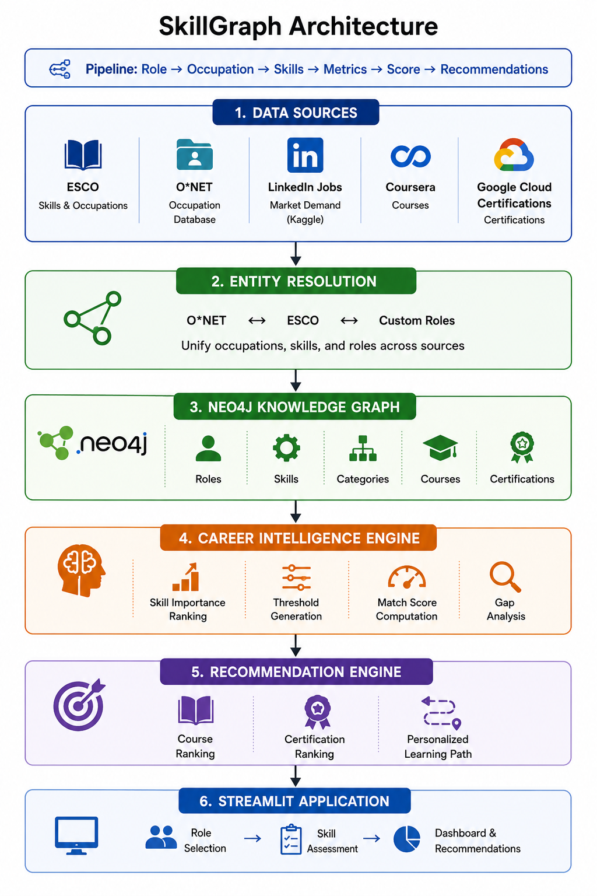
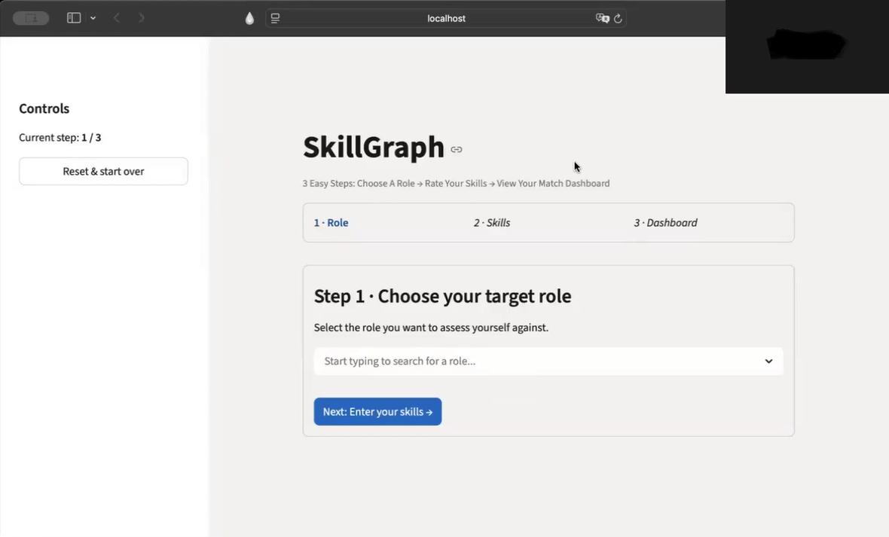
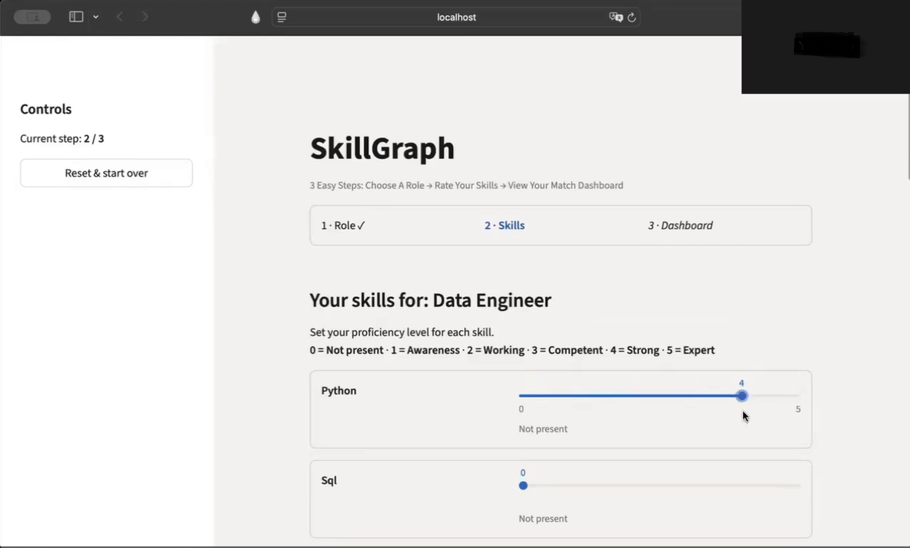
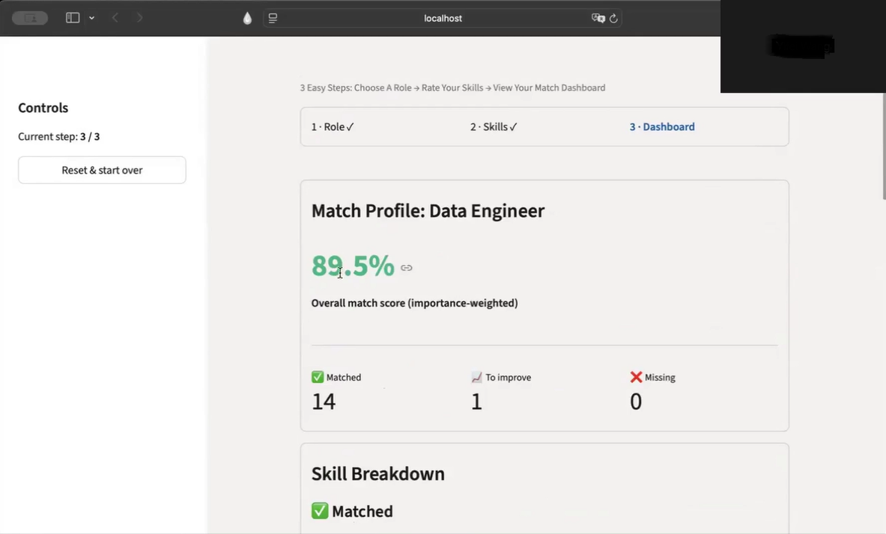
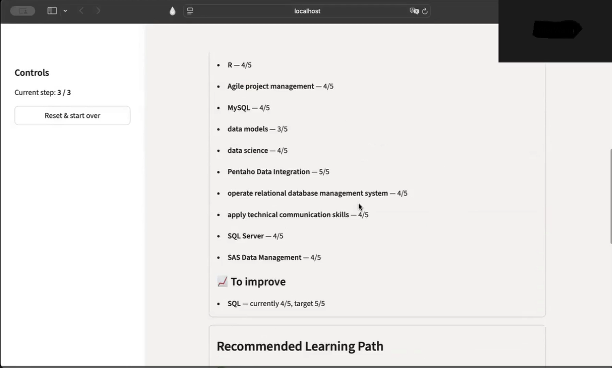
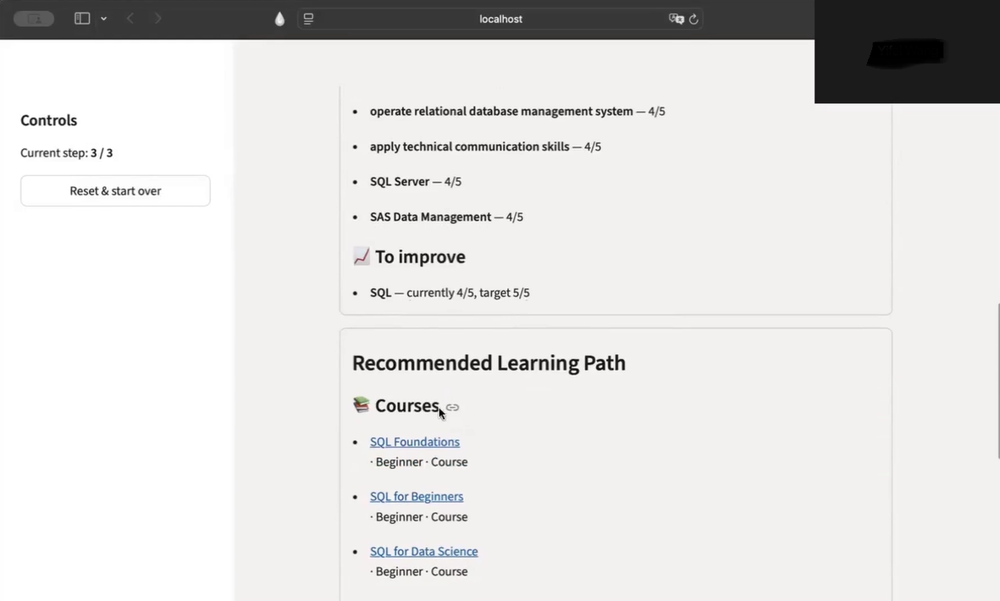
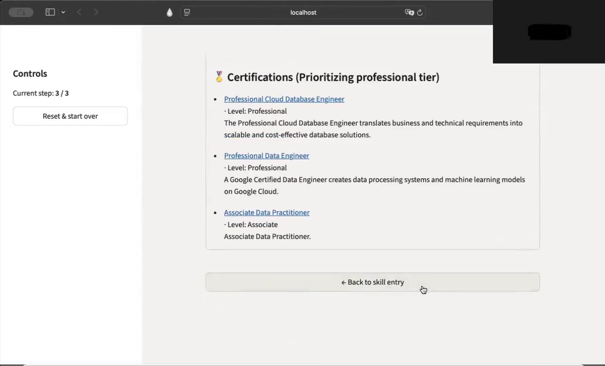
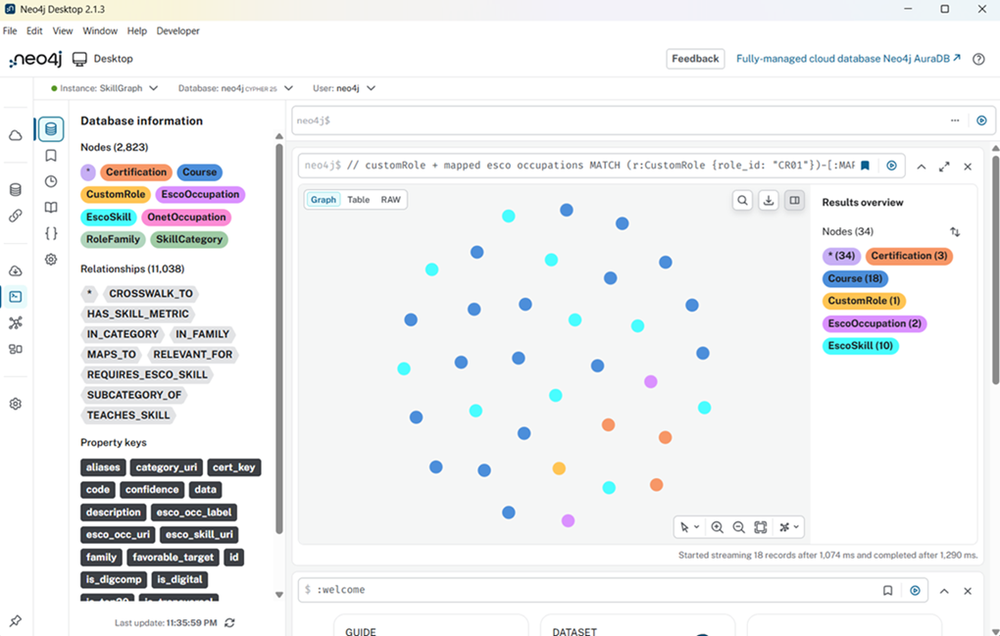
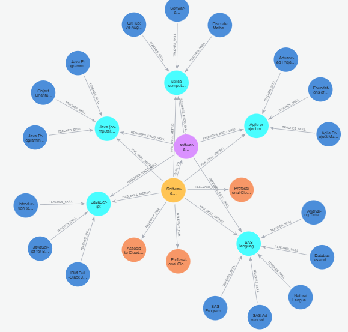

# SkillGraph: A Knowledge Graph for Career Intelligence

SkillGraph is a knowledge graph-based career recommendation system that helps users evaluate their readiness for a target role, identify skill gaps, and discover personalized learning recommendations.

Built using **Neo4j**, **ESCO skill taxonomy**, and **Streamlit**, the system combines graph reasoning with importance-weighted scoring to provide explainable career guidance.

## Highlights

- Built a Neo4j Knowledge Graph containing occupations, skills, courses, certifications, and career pathways.
- Developed an importance-weighted skill scoring engine using LinkedIn demand signals and ESCO skill relationships.
- Implemented explainable skill-gap analysis and role readiness scoring.
- Designed personalized course and certification recommendation workflows.
- Created a Streamlit-based interactive career intelligence application.

## Motivation

Many professionals know where they want to go but struggle to understand what skills they need to get there.

Existing career guidance systems face several challenges:

- No structured self-assessment workflow
- Limited skill prioritization
- Generic course recommendations
- Certifications disconnected from actual skill gaps
- Occupational taxonomies that are often too broad for modern technology roles

SkillGraph was built to bridge this gap through a knowledge graph-driven career intelligence platform that combines occupational data, market demand signals, and learning resources into a unified recommendation system.


## Project Overview

Traditional career recommendation systems often function as black boxes, recommending roles without explaining the reasoning behind them.

SkillGraph addresses this challenge by modeling relationships between:

- Job Roles
- Skills
- Courses
- Certifications

within a Neo4j Knowledge Graph and using graph traversal techniques to generate transparent, actionable recommendations.

The platform allows users to:

1. Select a target role
2. Self-assess their proficiency across role-specific skills
3. Calculate a role readiness score
4. Identify missing and developing skills
5. Receive personalized course and certification recommendations

---

## Data Sources

SkillGraph combines structured knowledge sources, unstructured learning resources, and real-world market signals.

### Structured Sources

- **ESCO**: European Skills, Competences, Qualifications and Occupations framework
- **O*NET**: U.S. occupational database providing occupation-to-skill mappings

### Learning Resources

- **Coursera**
- **Google Cloud Certifications**

### Market Signals

- **LinkedIn Jobs Dataset (Kaggle)**

The combination of these sources enables SkillGraph to generate recommendations that are both semantically grounded and aligned with real-world hiring demand.


## System Architecture

<p align="center">
  
</p>

### Workflow

1. ESCO skills and occupation data are processed and loaded into Neo4j.
2. Custom role profiles are created with weighted skill requirements.
3. Users select a target role.
4. The system retrieves the most important skills associated with that role.
5. Users rate their proficiency levels.
6. SkillGraph computes an importance-weighted match score.
7. Missing and underdeveloped skills are identified.
8. Relevant courses and certifications are recommended through graph traversal.

---

## Key Features

### Role Readiness Assessment

Evaluate readiness for a target role using an importance-weighted scoring model.

### Explainable Skill Gap Analysis

Skills are categorized into:

- ✅ Matched Skills
- 📈 Skills to Improve
- ❌ Missing Skills

allowing users to understand exactly where they stand.

### Personalized Learning Recommendations

Recommend courses that directly address missing or underdeveloped skills.

### Certification Guidance

Recommend certifications based on the user's readiness level:

- Foundational
- Associate
- Professional

### Knowledge Graph Reasoning

Leverages graph relationships to connect:

- Roles → Skills
- Skills → Courses
- Roles → Certifications

creating explainable recommendations rather than black-box outputs.

---

## Key Innovations

### Market-Driven Skill Ranking

One limitation of ESCO is that skills are not ranked by importance.

SkillGraph introduces a market-driven ranking methodology:

**Skill Importance = LinkedIn Demand + ESCO Overlap**

This enables the platform to prioritize skills based on real-world hiring demand rather than treating all skills equally.

---

### Semantic Role Curation

Initial keyword-based occupation filtering produced noisy matches such as unrelated engineering and management roles.

To improve relevance, SkillGraph introduces a curated set of modern technology roles including:

- AI Engineer
- Machine Learning Engineer
- Data Scientist
- Data Engineer
- Cloud Engineer
- DevOps Engineer
- Full Stack Developer

This significantly improves recommendation quality.

---

### Importance-Weighted Course Ranking

Course recommendations are ranked according to the importance of the skill gaps they address.

This produces personalized learning pathways instead of generic course lists.

---

### Score-Aware Certification Recommendations

Certification recommendations adapt to candidate readiness.

| Match Score | Certification Tier |
|------------|-------------------|
| < 40% | Foundational |
| 40–69% | Associate |
| ≥ 70% | Professional |

This prevents early-stage learners from being overwhelmed by advanced certifications while helping experienced candidates validate near-complete readiness.

---

## Knowledge Graph Design

### Node Types

| Node Type | Description |
|------------|------------|
| CustomRole | User-facing technology role |
| EscoOccupation | Filtered ESCO occupation |
| EscoSkill | Core skill entity |
| SkillCategory | ESCO skill hierarchy |
| OnetOccupation | O*NET occupation mapping |
| Course | Learning resource |
| Certification | Professional certification |

### Relationship Types

| Relationship | Description |
|-------------|-------------|
| MAPS_TO | Role mapping |
| REQUIRES | Occupation-skill relationship |
| CATEGORY | Skill hierarchy |
| TEACHES | Course teaches a skill |
| RELEVANT_FOR | Certification relevant for a role |
| HAS_SKILL_METRIC | Skill importance and threshold metadata |

### Example Graph Structure

```text
(CustomRole)
      |
      | HAS_SKILL_METRIC
      v
 (EscoSkill)
      ^
      |
 TEACHES_SKILL
      |
   (Course)

(CustomRole)
      |
 RELEVANT_FOR
      |
(Certification)
```

## Scoring Methodology

Each role skill contains:

- Skill Importance
- Minimum Required Proficiency
- Favorable Target Proficiency

Candidate ratings are compared against these thresholds.

### Skill Classification
Matched: Candidate proficiency ≥ favorable target

To Improve: Minimum required ≤ candidate proficiency < favorable target

Missing: Candidate proficiency < minimum required

### Overall Match Score

The final score is calculated as an importance-weighted average across all required skills.

This provides a more realistic assessment than treating every skill equally.

## User Experience
### Step 1: Select a Target Role

Users choose the role they want to evaluate themselves against.



### Step 2: Assess Skills

Users rate their proficiency levels for the role's most important skills.



### Step 3: View Match Dashboard

SkillGraph generates:

- Overall Match Score
- Skill Breakdown
- Missing Skills
- Skills to Improve
- Learning Recommendations
- Certification Recommendations

#### Match Score



#### Skill Analysis



#### Learning Recommendations



#### Certification Recommendations



## Neo4j Knowledge Graph

The graph stores relationships between roles, skills, courses, and certifications, enabling explainable recommendation generation through graph traversal.





## Repository Structure

```text
skillgraph-career-recommendation/

├── data/
├── notebooks/
│   └── skillgraph_py_code.ipynb
│
├── src/
│   ├── build_esco_master.py
│   ├── skillgraph_ui.py
│   └── neo4j_query_saved_cypher_skillgraph.csv
│
├── screenshots/
│   ├── architecture.png
│   ├── graph_view.png
│   ├── step1_role_selection.png
│   ├── step2_skill_entry.png
│   └── step3_dashboard.png
│
└── README.md
```

## Technology Stack
### Backend
- Python
- Neo4j
- Cypher
### Frontend
- Streamlit
### Data Processing
- Pandas
- ESCO Skills Framework
### Knowledge Representation
- Knowledge Graphs
- Graph Traversal
- Relationship-Based Reasoning


## How to Run

### 1. Clone Repository

```bash
git clone https://github.com/pragna9h/skillgraph-career-recommendation.git
cd skillgraph-career-recommendation
```

### 2. Install Dependencies

```bash
pip install -r requirements.txt
```

### 3. Configure Neo4j Credentials

Create:

`.streamlit/secrets.toml`

```toml
NEO4J_URI="bolt://localhost:7687"
NEO4J_USER="neo4j"
NEO4J_PASSWORD="your-password"
```

### 4. Launch the Application

```bash
streamlit run src/skillgraph_ui.py
```

## Project Metrics

- 15 curated technology roles
- 11,000+ graph relationships
- Multiple integrated data sources (ESCO, O*NET, LinkedIn, Coursera, Google Cloud)
- Importance-weighted skill ranking framework
- Explainable recommendation engine

## Results
- Built a Neo4j-based career intelligence platform using knowledge graphs.
- Developed an explainable skill-gap scoring engine.
- Connected role requirements to learning pathways through graph relationships.
- Generated personalized course and certification recommendations.
- Created an interactive Streamlit application for career self-assessment.

## Evaluation

Career intelligence systems lack a publicly available ground-truth benchmark.

To evaluate SkillGraph, structured proxy validation was performed using:

- ESCO occupational relationships
- LinkedIn demand signals
- Role-specific heuristics

Evaluation focused on:

- Realistic skill recommendations
- Plausible proficiency thresholds
- Consistent scoring behavior
- Explainable recommendation outputs

Results showed that the system generates recommendations that are realistic, interpretable, and aligned with market demand.


## Future Improvements
- Resume-to-role matching
- Automated skill extraction using NLP
- Learning roadmap generation
- LLM-powered career coaching
- Multi-role comparison dashboard
- Interactive graph visualization inside the application
